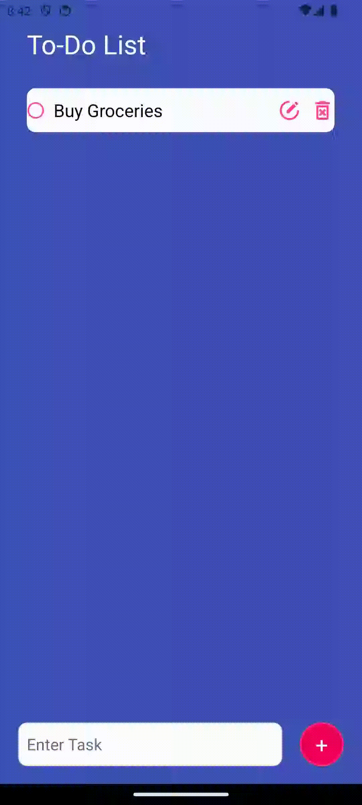
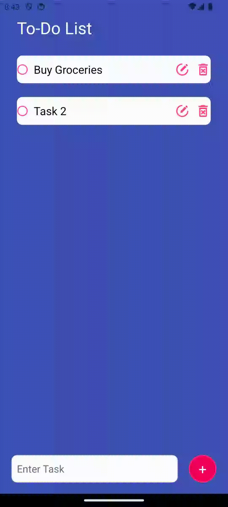
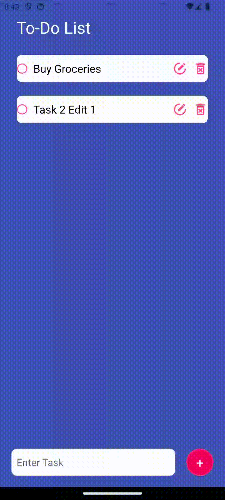

# React TODO Planner
1. Install
   `npm install react-native-uuid`
   `npx expo install`

2. Emulate on Expo Go
   Make sure Android Studio Virtual Device (emulator) is open
   `npx expo start`
   `Press a │ open Android`

## Features
- Add Task

-  Edit Task

- Toggle task (strikethrough text), Cancel Edit, Delete Task
